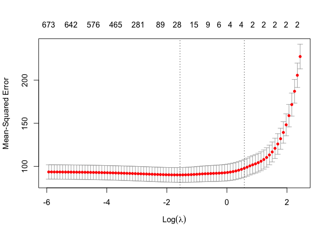
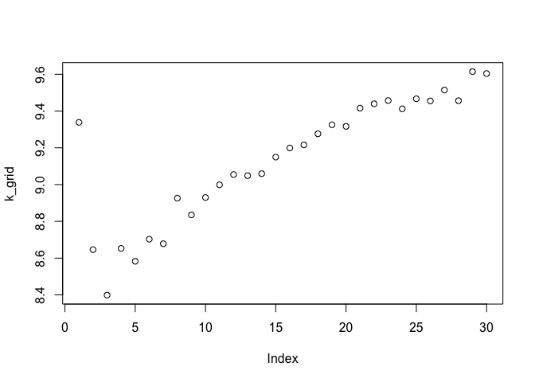
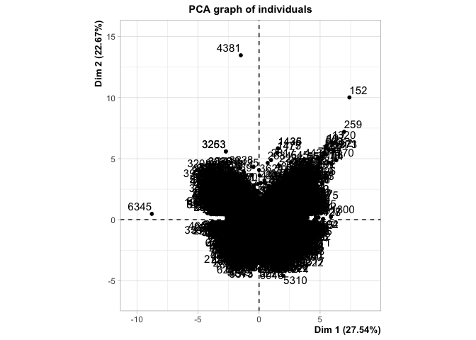
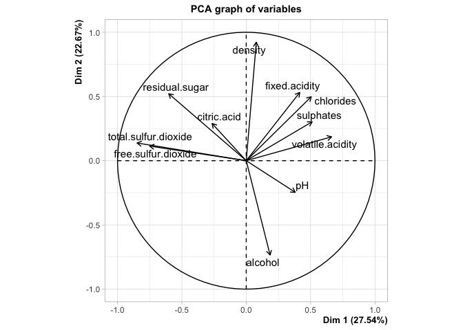
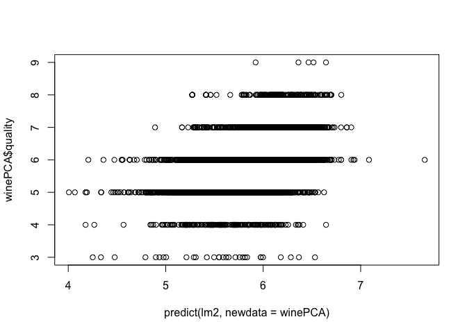
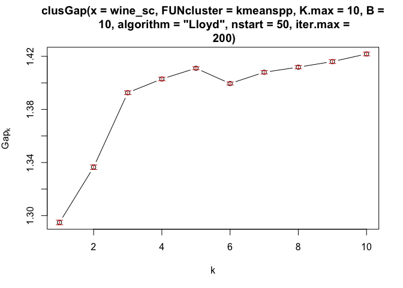
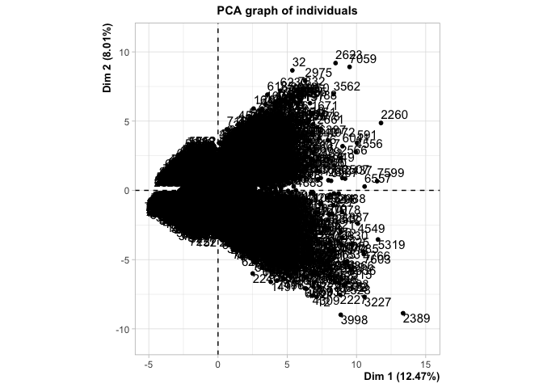
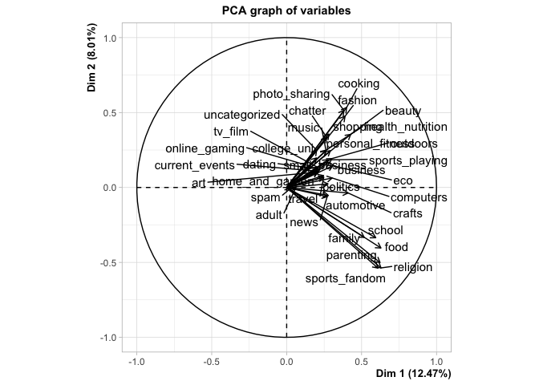

PREDICTIVE MODEL BUILDING

    library(tidyverse)

    ## ── Attaching packages ─────────────────────────────────────────────────────────── tidyverse 1.3.0 ──

    ## ✓ ggplot2 3.2.1     ✓ purrr   0.3.3
    ## ✓ tibble  2.1.3     ✓ dplyr   0.8.3
    ## ✓ tidyr   1.0.0     ✓ stringr 1.4.0
    ## ✓ readr   1.3.1     ✓ forcats 0.4.0

    ## ── Conflicts ────────────────────────────────────────────────────────────── tidyverse_conflicts() ──
    ## x dplyr::filter() masks stats::filter()
    ## x dplyr::lag()    masks stats::lag()

    data <- read.csv("~/Documents/R/SDS 323/SDS323-master/data/greenbuildings.csv")

    # remove na rows
    data <- data[-which(is.na(data), arr.ind = TRUE)[,1],]

    X  <- dplyr::select(data, -Rent, -LEED, -Energystar, -CS_PropertyID)
    y <- data$Rent

    X$green_rating <- factor(X$green_rating)
    X$net <- factor(X$net)
    X$cluster <- factor(X$cluster)
    X$renovated <- factor(X$renovated)
    X$class_a <- factor(X$class_a)
    X$class_b <- factor(X$class_b)
    X$amenities <- factor(X$amenities)

    green <- cbind(X,y)

    str(X)

    ## 'data.frame':    7820 obs. of  19 variables:
    ##  $ cluster          : Factor w/ 687 levels "1","6","8","11",..: 1 1 1 1 1 1 2 2 2 2 ...
    ##  $ size             : int  260300 67861 164848 93372 174307 231633 210038 225895 912011 518578 ...
    ##  $ empl_gr          : num  2.22 2.22 2.22 2.22 2.22 2.22 4.01 4.01 4.01 4.01 ...
    ##  $ leasing_rate     : num  91.4 87.1 88.9 97 96.6 ...
    ##  $ stories          : int  14 5 13 13 16 14 11 15 31 21 ...
    ##  $ age              : int  16 27 36 46 5 20 38 24 34 36 ...
    ##  $ renovated        : Factor w/ 2 levels "0","1": 1 1 2 2 1 1 1 1 1 2 ...
    ##  $ class_a          : Factor w/ 2 levels "0","1": 2 1 1 1 2 2 1 2 2 2 ...
    ##  $ class_b          : Factor w/ 2 levels "0","1": 1 2 2 2 1 1 2 1 1 1 ...
    ##  $ green_rating     : Factor w/ 2 levels "0","1": 2 1 1 1 1 1 2 1 1 1 ...
    ##  $ net              : Factor w/ 2 levels "0","1": 1 1 1 1 1 1 1 1 1 1 ...
    ##  $ amenities        : Factor w/ 2 levels "0","1": 2 2 2 1 2 2 2 2 2 2 ...
    ##  $ cd_total_07      : int  4988 4988 4988 4988 4988 4988 2746 2746 2746 2746 ...
    ##  $ hd_total07       : int  58 58 58 58 58 58 1670 1670 1670 1670 ...
    ##  $ total_dd_07      : int  5046 5046 5046 5046 5046 5046 4416 4416 4416 4416 ...
    ##  $ Precipitation    : num  42.6 42.6 42.6 42.6 42.6 ...
    ##  $ Gas_Costs        : num  0.0137 0.0137 0.0137 0.0137 0.0137 ...
    ##  $ Electricity_Costs: num  0.029 0.029 0.029 0.029 0.029 ...
    ##  $ cluster_rent     : num  36.8 36.8 36.8 36.8 36.8 ...

    rmse <- function(y, y_hat) {
      sqrt( mean( (y-y_hat)^2 ) )
    }

    set.seed(100)
    library(lmvar)

    # null model
    l0 <- lm(y ~., data = green, x = TRUE, y = TRUE)
    cv.lm(l0, k = 10)

    ## Mean absolute error        :  5.657055 
    ## Sample standard deviation  :  0.4588094 
    ## 
    ## Mean squared error         :  118.9978 
    ## Sample standard deviation  :  46.98697 
    ## 
    ## Root mean squared error    :  10.73089 
    ## Sample standard deviation  :  2.06716

    set.seed(100)
    library(glmnet)

    ## Loading required package: Matrix

    ## 
    ## Attaching package: 'Matrix'

    ## The following objects are masked from 'package:tidyr':
    ## 
    ##     expand, pack, unpack

    ## Loaded glmnet 3.0-2

    # prep the data
    X <- model.matrix(y ~. -1, data = green)

    # run lasso CV
    penalty <- c(rep(1, 695),0, rep(1, ncol(X) - 695 - 1))
    cv.lasso <- cv.glmnet(X, y, alpha = 1, family = "gaussian", nfolds = 10, penalty.factor = penalty)
    plot(cv.lasso)

    # K=10 CV
    k_grid <- seq(1, 10, by = 1)
    fold_id <- rep(1:10, length.out = nrow(X))
    fold_id <- sample(fold_id)
    for(k in k_grid) {
      train_set <- which(fold_id != k)
      X_train <- X[train_set,]
      X_test <- X[-train_set,]
      y_train <- y[train_set]
      y_test <- y[-train_set]
      
      model <- glmnet(X_train, y_train, family = "gaussian", lambda = cv.lasso$lambda.1se)
      y_hat <- predict(model, newx = X_test)
      
      k_grid[k] <- rmse(y_test, y_hat)
    }

    # rmse
    mean(k_grid)

    ## [1] 9.818896

    # get non-zero coeficients
    lasso_coefs <- rownames(coef(cv.lasso))[coef(cv.lasso)[,1] != 0]

    # print coefficients and beta-hat
    lasso_coefs

    ## [1] "(Intercept)"   "size"          "green_rating1" "cluster_rent"

    coef(cv.lasso)[coef(cv.lasso)[,1]!=0]

    ## <sparse>[ <logic> ] : .M.sub.i.logical() maybe inefficient

    ## [1] 2.729244e+00 1.545249e-06 2.185621e+00 9.139432e-01

Holding other features constant, green certification increases rent per
square foot by $2.19 on average.

    set.seed(100)
    library(FNN)

    # prep the data
    #X  <- dplyr::select(data, -Rent, -LEED, -Energystar, -CS_PropertyID)
    X <- dplyr::select(data, -Rent, size, green_rating, cluster_rent)
    n <- nrow(X)
    train_n <- n * 0.8

    # KNN regression
    k_grid <- seq(1, 30, by = 1)
    for(k in k_grid) {
      err <- rep(0, 10)
      
      fold_id <- rep(1:10, length.out = n)
      fold_id <- sample(fold_id)
      for(i in 1:10) {
        train_set <- which(fold_id != i)
        X_train <- X[train_set,]
        X_test <- X[-train_set,]
        y_train <- y[train_set]
        y_test <- y[-train_set]

        scale_factors <- apply(X_train, 2, sd, na.rm = TRUE)
        X_train_sc <- scale(X_train, scale = scale_factors)
        X_test_sc <- scale(X_test, scale = scale_factors)

        model <- knn.reg(X_train_sc, X_test_sc, y_train, k)
        err[i] <- rmse(y_test, model$pred)
      }
      
      k_grid[k] <- mean(err)
    }

    plot(k_grid)

    # rmse for optimal K
    min(k_grid)

    ## [1] 8.398637

    which.min(k_grid)

    ## [1] 3

WHAT CAUSES WHAT?

1.  Because there is no control group. We could easily collect data from
    cities who are dispensing many police officers to combat their high
    crime rates. This would lead us to mistakenly conclude that police
    and crime are positively correlated, when it is more likely that the
    crime rates are lower than they would have been with less police
    officers.

2.  The researches isolated the effect of police officers by collecting
    data from high alert days. These were days when many police officers
    were dispensed because of a terrorism threat, not because of crime.
    This way the researches could invistigate the independent
    relationship between police officers and crime rate.

3.  The researchers theorized that on high alert days many people may
    stay inside (for fear of terrorism), so crime would decrease on
    these days and it would not be a result of the increase in police
    officers. So they used metro ridership as a measure of outdoor
    activity to control for this.

4.  This model uses log(ridership) and dummy variables for high alert
    days, district 1, and their interaction to predict crime. The table
    shows us that ridership has a positive relationship with crime and
    high alert status has a negative relationship with crime in
    district 1. From this we can conclude that having more police
    officers decreases crime, because on high alert days (when there are
    more police officers) crime decreases. We know this is because of
    the increase in police officers because the ridership term controls
    for how many people are outdoors. We do not need to worry about the
    coefficient for the interaction term between high alert days and
    other districts being insignificant, because on high alert days
    police officers are mainly dispensed to district 1.

CLUSTERING AND PCA

    library(tidyverse)
    library(caret)

    ## Loading required package: lattice

    ## 
    ## Attaching package: 'caret'

    ## The following object is masked from 'package:purrr':
    ## 
    ##     lift

    library(ggplot2)
    library(FactoMineR)
    library(LICORS)
    library(ggplot2)
    library(cluster)
    library(fpc)
    library(NbClust)
    library(boot)

    ## 
    ## Attaching package: 'boot'

    ## The following object is masked from 'package:lattice':
    ## 
    ##     melanoma

    set.seed(100)

    data <- read.csv("~/Documents/R/SDS 323/SDS323-master/data/wine.csv")
    dmy <- dummyVars("~.", data = data)
    wine <- data.frame(predict(dmy, newdata = data))
    # color.red and color.white contain the same information as there are no mixed wines in the data set, so we only keep color.white
    wine$color.red <- NULL
    wine <- rename(wine, "white" = "color.white")

    # scale the data for PCA and Kmeans
    # exclude color and quality
    wine_sc <- scale(wine[,1:11], scale = TRUE, center = TRUE)
    # run PCA
    PCA(wine_sc, graph = TRUE)

    ## **Results for the Principal Component Analysis (PCA)**
    ## The analysis was performed on 6497 individuals, described by 11 variables
    ## *The results are available in the following objects:
    ## 
    ##    name               description                          
    ## 1  "$eig"             "eigenvalues"                        
    ## 2  "$var"             "results for the variables"          
    ## 3  "$var$coord"       "coord. for the variables"           
    ## 4  "$var$cor"         "correlations variables - dimensions"
    ## 5  "$var$cos2"        "cos2 for the variables"             
    ## 6  "$var$contrib"     "contributions of the variables"     
    ## 7  "$ind"             "results for the individuals"        
    ## 8  "$ind$coord"       "coord. for the individuals"         
    ## 9  "$ind$cos2"        "cos2 for the individuals"           
    ## 10 "$ind$contrib"     "contributions of the individuals"   
    ## 11 "$call"            "summary statistics"                 
    ## 12 "$call$centre"     "mean of the variables"              
    ## 13 "$call$ecart.type" "standard error of the variables"    
    ## 14 "$call$row.w"      "weights for the individuals"        
    ## 15 "$call$col.w"      "weights for the variables"

    pr.out <- prcomp(wine[1:11], center = TRUE, scale = TRUE)
    summary(pr.out)

    ## Importance of components:
    ##                           PC1    PC2    PC3     PC4     PC5     PC6     PC7
    ## Standard deviation     1.7407 1.5792 1.2475 0.98517 0.84845 0.77930 0.72330
    ## Proportion of Variance 0.2754 0.2267 0.1415 0.08823 0.06544 0.05521 0.04756
    ## Cumulative Proportion  0.2754 0.5021 0.6436 0.73187 0.79732 0.85253 0.90009
    ##                            PC8     PC9   PC10    PC11
    ## Standard deviation     0.70817 0.58054 0.4772 0.18119
    ## Proportion of Variance 0.04559 0.03064 0.0207 0.00298
    ## Cumulative Proportion  0.94568 0.97632 0.9970 1.00000

    # baseline
    mean(wine$white)

    ## [1] 0.7538864

    # Use principle components to predict quality and color
    winePCA <- cbind(wine, pr.out$x)
    lm1 <- glm(white ~ PC1 + PC2, data = winePCA, family = binomial)

    ## Warning: glm.fit: fitted probabilities numerically 0 or 1 occurred

    pred <- sapply(predict(lm1, newdata = winePCA), function(x){ifelse(x>0.5, x <- 1, x <- 0)})
    summary(lm1)

    ## 
    ## Call:
    ## glm(formula = white ~ PC1 + PC2, family = binomial, data = winePCA)
    ## 
    ## Deviance Residuals: 
    ##     Min       1Q   Median       3Q      Max  
    ## -5.2500   0.0004   0.0138   0.0566   3.4587  
    ## 
    ## Coefficients:
    ##             Estimate Std. Error z value Pr(>|z|)    
    ## (Intercept)  4.45402    0.20113   22.14   <2e-16 ***
    ## PC1          3.88254    0.16253   23.89   <2e-16 ***
    ## PC2         -0.91322    0.07306  -12.50   <2e-16 ***
    ## ---
    ## Signif. codes:  0 '***' 0.001 '**' 0.01 '*' 0.05 '.' 0.1 ' ' 1
    ## 
    ## (Dispersion parameter for binomial family taken to be 1)
    ## 
    ##     Null deviance: 7250.98  on 6496  degrees of freedom
    ## Residual deviance:  737.17  on 6494  degrees of freedom
    ## AIC: 743.17
    ## 
    ## Number of Fisher Scoring iterations: 9

    # CV
    K <- 10
    k_grid <- seq(1:K)
    fold_id <- rep(1:K, nrow(winePCA))
    fold_id <- sample(fold_id)
    for(k in 1:K) {
      train_set <- which(fold_id != k)
      train <- winePCA[train_set,]
      test <- winePCA[-train_set,]
      
      model <- glm(white ~ PC1 + PC2, family = binomial, data = train)
      y_hat <- predict(model, newdata = test)
      y_hat <- ifelse(y_hat > 0.5, 1, 0)
      
      k_grid[k] <- mean(y_hat == test$white)
    }

    ## Warning: glm.fit: fitted probabilities numerically 0 or 1 occurred

    ## Warning: glm.fit: fitted probabilities numerically 0 or 1 occurred

    ## Warning: glm.fit: fitted probabilities numerically 0 or 1 occurred

    ## Warning: glm.fit: fitted probabilities numerically 0 or 1 occurred

    ## Warning: glm.fit: fitted probabilities numerically 0 or 1 occurred

    ## Warning: glm.fit: fitted probabilities numerically 0 or 1 occurred

    ## Warning: glm.fit: fitted probabilities numerically 0 or 1 occurred

    ## Warning: glm.fit: fitted probabilities numerically 0 or 1 occurred

    ## Warning: glm.fit: fitted probabilities numerically 0 or 1 occurred

    ## Warning: glm.fit: fitted probabilities numerically 0 or 1 occurred

    # accuracy
    mean(k_grid)

    ## [1] 0.9844617

    lm2 <- glm(quality ~ PC1 + PC2 + PC3 + PC4 + PC5, data = winePCA, family = gaussian)
    summary(lm2)

    ## 
    ## Call:
    ## glm(formula = quality ~ PC1 + PC2 + PC3 + PC4 + PC5, family = gaussian, 
    ##     data = winePCA)
    ## 
    ## Deviance Residuals: 
    ##     Min       1Q   Median       3Q      Max  
    ## -3.5316  -0.5149  -0.0467   0.5240   3.0777  
    ## 
    ## Coefficients:
    ##              Estimate Std. Error t value Pr(>|t|)    
    ## (Intercept)  5.818378   0.009632 604.085  < 2e-16 ***
    ## PC1          0.038202   0.005534   6.903 5.56e-12 ***
    ## PC2         -0.174166   0.006100 -28.553  < 2e-16 ***
    ## PC3         -0.150821   0.007721 -19.533  < 2e-16 ***
    ## PC4         -0.146175   0.009778 -14.950  < 2e-16 ***
    ## PC5         -0.182980   0.011353 -16.117  < 2e-16 ***
    ## ---
    ## Signif. codes:  0 '***' 0.001 '**' 0.01 '*' 0.05 '.' 0.1 ' ' 1
    ## 
    ## (Dispersion parameter for gaussian family taken to be 0.6027274)
    ## 
    ##     Null deviance: 4953.7  on 6496  degrees of freedom
    ## Residual deviance: 3912.3  on 6491  degrees of freedom
    ## AIC: 15156
    ## 
    ## Number of Fisher Scoring iterations: 2

    plot(predict(lm2, newdata = winePCA), winePCA$quality)

    # RMSE
    sqrt(cv.glm(data = winePCA, lm2, K = 10)$delta[1])

    ## [1] 0.7768232

    # using 2 centers for the two colors of wine
    km2 <- kmeanspp(wine_sc, 2, nstart = 50)
    wineK <- cbind(wine, km2$cluster)
    wineK <- rename(wineK, "cluster" = "km2$cluster")

    # CV
    k_grid <- seq(1:K)
    fold_id <- rep(1:10, length.out = nrow(wineK))
    fold_id <- sample(fold_id)
    for(k in k_grid) {
      train_set <- which(fold_id != k)
      train <- wineK[train_set,]
      test <- wineK[-train_set,]
      
      model <- glm(white ~ cluster, family = binomial, data = train)
      y_hat <- predict(model, newdata = test)
      y_hat <- ifelse(y_hat > 0.5, 1, 0)
      
      k_grid[k] <- mean(y_hat == test$white)
    }
    # accuracy
    mean(k_grid)

    ## [1] 0.9858388

    wine_gap <- clusGap(wine_sc, FUN = kmeanspp, algorithm = "Lloyd", nstart = 50, K.max = 10, iter.max = 200, B = 10)
    plot(wine_gap)

    # Gap plot indicates that 5 is the optimal number of clusters
    km5 <- kmeanspp(wine_sc, 5, nstart = 50)

    ## Warning: Quick-TRANSfer stage steps exceeded maximum (= 324850)

    wineK <- cbind(wine, km5$cluster)
    wineK <- rename(wineK, "cluster" = "km5$cluster")
    lm3 <- glm(quality ~ cluster, data = wineK, family = gaussian)
    # RMSE
    sqrt(cv.glm(data = wineK, lm3, K = 10)$delta[1])

    ## [1] 0.8507222

The PCA is helpful for showing what chemical properties tend to be
associated together. We can see from the variable graph that wines high
in fixed acidity also tend to be high in sulphates, chlorides, and
volatile acidity. After running PCA we can use the first two principle
components to predict wine color with 98.4% accuracy. We can also use
the first five principle components to predict wine quality with a RMSE
of 0.77. This certainly is high enough accuracy to seperate high from
low quality wines, where the model struggles is in predicting the exact
quality of a wine, and in seperating middle of the road wines. For
clustering, I used k-means and my initial choice was to use two
clusters, one for each color of wine. Using only the clusters generated
from k-means we can predict wine color with 98.6% accuracy, which is
marginably better than we accomplished with PCA. I then used a plot of
Gap Statistic to find the optimal number of clusters, which was 5. Then
I ran k-means again with 5 clusters, and using only the cluster for each
wine, the model was able to predict quality with a RMSE of 0.87. This is
still certainly a low enough RMSE to be able to seperate high from low
quality wines. However it is significantly worse than our model using
PCA. Because of this PCA makes more sense for the data, as it can
predict wine color with a similar accuracy to cluster, performs better
in predicting quality, and also provides information about the
relationship of chemical properties.

MARKET SEGMENTATION

    library(FactoMineR)
    library(LICORS)
    set.seed(123)

    data <- read.csv("~/Documents/R/SDS 323/SDS323-master/data/social_marketing.csv")
    tweets <- dplyr::select(data, -X)

    tweets_sc <- scale(tweets, scale = TRUE, center = TRUE)
    PCA(tweets_sc, graph = TRUE)

    ## **Results for the Principal Component Analysis (PCA)**
    ## The analysis was performed on 7882 individuals, described by 36 variables
    ## *The results are available in the following objects:
    ## 
    ##    name               description                          
    ## 1  "$eig"             "eigenvalues"                        
    ## 2  "$var"             "results for the variables"          
    ## 3  "$var$coord"       "coord. for the variables"           
    ## 4  "$var$cor"         "correlations variables - dimensions"
    ## 5  "$var$cos2"        "cos2 for the variables"             
    ## 6  "$var$contrib"     "contributions of the variables"     
    ## 7  "$ind"             "results for the individuals"        
    ## 8  "$ind$coord"       "coord. for the individuals"         
    ## 9  "$ind$cos2"        "cos2 for the individuals"           
    ## 10 "$ind$contrib"     "contributions of the individuals"   
    ## 11 "$call"            "summary statistics"                 
    ## 12 "$call$centre"     "mean of the variables"              
    ## 13 "$call$ecart.type" "standard error of the variables"    
    ## 14 "$call$row.w"      "weights for the individuals"        
    ## 15 "$call$col.w"      "weights for the variables"

    pr.out <- prcomp(tweets, scale = TRUE, center = TRUE)
    pr.out$rotation[,1:4]

    ##                          PC1          PC2          PC3          PC4
    ## chatter          -0.12599239  0.197225501 -0.074806851  0.112831403
    ## current_events   -0.09723669  0.064036499 -0.052239713  0.029848593
    ## travel           -0.11664903  0.039947269 -0.424259712 -0.145428394
    ## photo_sharing    -0.18027952  0.303077634  0.010709504  0.151490987
    ## uncategorized    -0.09443507  0.146498856  0.030541854  0.019245743
    ## tv_film          -0.09745666  0.079352508 -0.086209601  0.089930695
    ## sports_fandom    -0.28773177 -0.316923635  0.051996724  0.057232654
    ## politics         -0.13026617  0.013939964 -0.489902729 -0.196726038
    ## food             -0.29690952 -0.237808675  0.111477283 -0.073328796
    ## family           -0.24426866 -0.196253208  0.049318370  0.072719290
    ## home_and_garden  -0.11576501  0.046803486 -0.021178952 -0.009935133
    ## music            -0.12408921  0.144259544  0.012287743  0.082582722
    ## news             -0.12764328 -0.036198891 -0.336035553 -0.176876091
    ## online_gaming    -0.07388979  0.083591578 -0.055108087  0.220762958
    ## shopping         -0.13299500  0.209852847 -0.047222593  0.103611512
    ## health_nutrition -0.12420109  0.146577761  0.225514824 -0.463466615
    ## college_uni      -0.09415672  0.115959664 -0.085412395  0.255587323
    ## sports_playing   -0.13021653  0.108595355 -0.042594612  0.175669905
    ## cooking          -0.18880850  0.314287972  0.194499733  0.010218127
    ## eco              -0.14533561  0.085321972  0.029449623 -0.123417770
    ## computers        -0.14333124  0.037334899 -0.367031460 -0.138312701
    ## business         -0.13501004  0.098782574 -0.105175459  0.012515829
    ## outdoors         -0.14260424  0.113581774  0.140390281 -0.414743250
    ## crafts           -0.19362762 -0.021623185 -0.002364522  0.022999196
    ## automotive       -0.13132522 -0.031564108 -0.190842652 -0.039211684
    ## art              -0.09794933  0.060347094 -0.049891634  0.061632689
    ## religion         -0.29709999 -0.316152778  0.093129415  0.066556413
    ## beauty           -0.20151836  0.208609941  0.150710454  0.146907571
    ## parenting        -0.29400412 -0.295082234  0.089165526  0.047360534
    ## dating           -0.10515646  0.071535239 -0.031346280 -0.028148475
    ## school           -0.28063791 -0.197572367  0.081644047  0.085846407
    ## personal_fitness -0.13750109  0.144611756  0.217374744 -0.444444831
    ## fashion          -0.18388185  0.279799725  0.138769497  0.137982768
    ## small_business   -0.11904181  0.094048059 -0.100597333  0.077686794
    ## spam             -0.01146092 -0.004551609 -0.012630747 -0.021332149
    ## adult            -0.02673097 -0.006918154  0.002867189 -0.023239634

    summary(pr.out)

    ## Importance of components:
    ##                           PC1     PC2     PC3     PC4     PC5     PC6     PC7
    ## Standard deviation     2.1186 1.69824 1.59388 1.53457 1.48027 1.36885 1.28577
    ## Proportion of Variance 0.1247 0.08011 0.07057 0.06541 0.06087 0.05205 0.04592
    ## Cumulative Proportion  0.1247 0.20479 0.27536 0.34077 0.40164 0.45369 0.49961
    ##                            PC8     PC9    PC10    PC11    PC12    PC13    PC14
    ## Standard deviation     1.19277 1.15127 1.06930 1.00566 0.96785 0.96131 0.94405
    ## Proportion of Variance 0.03952 0.03682 0.03176 0.02809 0.02602 0.02567 0.02476
    ## Cumulative Proportion  0.53913 0.57595 0.60771 0.63580 0.66182 0.68749 0.71225
    ##                           PC15    PC16   PC17    PC18    PC19    PC20    PC21
    ## Standard deviation     0.93297 0.91698 0.9020 0.85869 0.83466 0.80544 0.75311
    ## Proportion of Variance 0.02418 0.02336 0.0226 0.02048 0.01935 0.01802 0.01575
    ## Cumulative Proportion  0.73643 0.75979 0.7824 0.80287 0.82222 0.84024 0.85599
    ##                           PC22    PC23    PC24    PC25    PC26    PC27    PC28
    ## Standard deviation     0.69632 0.68558 0.65317 0.64881 0.63756 0.63626 0.61513
    ## Proportion of Variance 0.01347 0.01306 0.01185 0.01169 0.01129 0.01125 0.01051
    ## Cumulative Proportion  0.86946 0.88252 0.89437 0.90606 0.91735 0.92860 0.93911
    ##                           PC29    PC30    PC31   PC32    PC33    PC34    PC35
    ## Standard deviation     0.60167 0.59424 0.58683 0.5498 0.48442 0.47576 0.43757
    ## Proportion of Variance 0.01006 0.00981 0.00957 0.0084 0.00652 0.00629 0.00532
    ## Cumulative Proportion  0.94917 0.95898 0.96854 0.9769 0.98346 0.98974 0.99506
    ##                           PC36
    ## Standard deviation     0.42165
    ## Proportion of Variance 0.00494
    ## Cumulative Proportion  1.00000

For this analysis I am assuming that NutrientH20 is a health/fitness
company. From looking at the first five principle components (which
account for 40% of the variance in the data), we can pick out some
strong relationships within NutrientH20’s consumer basis. Tweets that
often involve cooking are positively correlated with photo sharing,
fashion and are negatively correlated with sports fans, religion, and
parenting. We can also see that personal fitness, outdoors, and health
are highly correlated. If NutrientH20 is trying to target health
concious tweeters (as their name seems to suggest), then they should
market more towards people who tweet about personal fitness and the
outdoors, because these people are likely to also care about health and
nutrition. And stay away from people who tweet about parenting,
religion, and being sports fans, because these are negatively related
with cooking. Using this informaiton, NutrientH20 should be able to
market to consumers more effectively and accurately.
